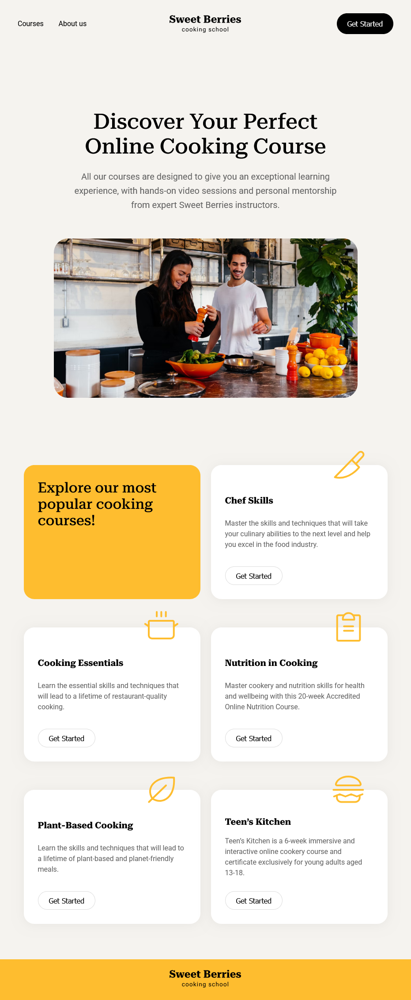
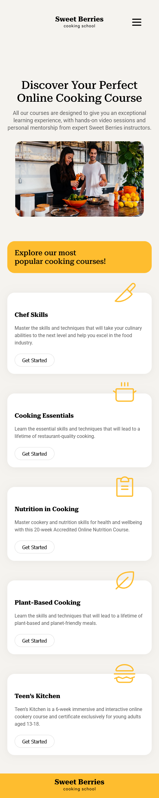

# Sweet Berries Cooking School


>A stylish and responsive web design for a fictional online cooking school. The website offers a modern structure with a clear focus on user experience, responsive design and mobile optimisation.

><b>Live Demo on GitHub Pages: </b><a href="https://david-voss.github.io/Sweet-Berries-Cooking-School/" target="_blank" rel="noopener noreferrer" title="david-voss.github.io/Sweet-Berries-Cooking-School/">Sweet Berries Cooking School</a>

<br>

## Brief Description

<p>This website offers an overview of the online cooking courses of the "Sweet Berries Cooking School". It offers:</p>
<ul>
    <li>Clear navigation
    <li>A hero segment with call-to-action
    <li>A course section with several thematic cards
    <li>Fully responsive layout for desktop, tablet and mobile
</ul>

<br>

## Preview of the Project

**_Desktop view:_**
<br>

<br>**_Tablet view:_**
<br>

<br>**_Mobile view:_**
<br>

<br><br>

## project Structure
```
project-root/
├── index.html
├── css/
│   ├── style.css
│   ├── style-tablet.css
│   └── style-mobile.css
└── assets/
    ├── Logo.svg
    ├── Menu.svg
    ├── Image.png
    ├── Image2.png
    ├── knife.svg
    ├── cooking-pot.svg
    ├── clipboard-text.svg
    ├── leaf.svg
    └── hamburger.svg
```

<br>

## Technologies used
- **HTML5**: semantic structure of the page
- **CSS3**: grid system, media queries, box shadows, modern typography
- **Google Fonts**: Roboto and Roboto Serif for a modern typeface

<br>

## Responsive design
The site is optimised for:
- **desktop** (> 1000px)
- **Tablet** (600px - 1000px)
- **Smartphones** (< 600px)

<br>
The files <em>style-tablet.css</em> and <em>style-mobile.css</em> are integrated via media queries and overwrite the desktop styles.